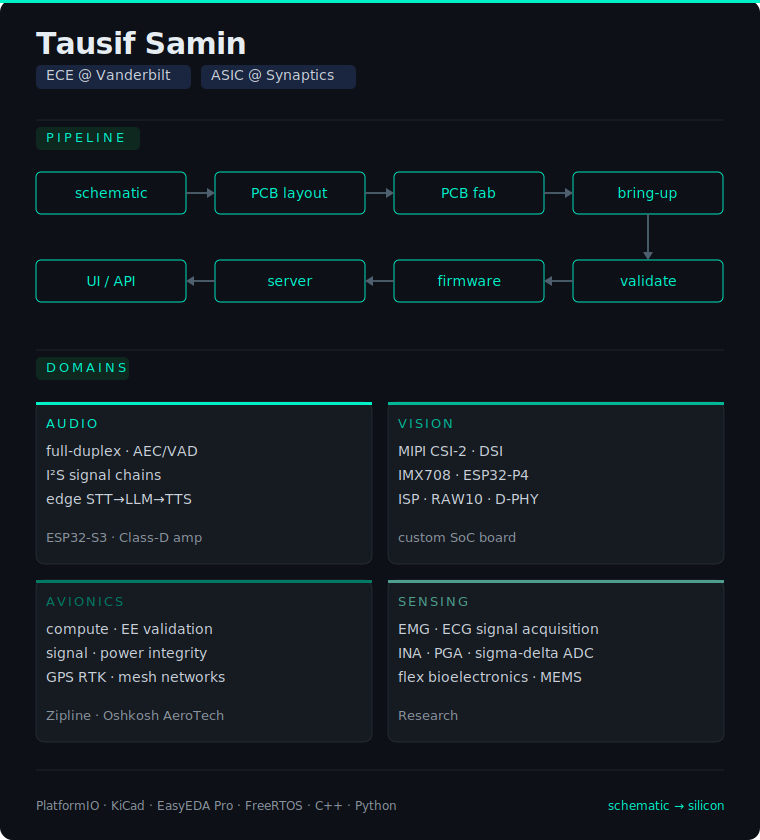

<div align="center">


</div>

---


```yaml
# ┌─ hardware engineer ──────────────────┐
# your yaml block here
```

---

### Currently Working On

<a href="https://github.com/out-of-mana8/esp32-talking-agent">
  
</a>

<br clear="left"/>

> Battery-powered ESP32-S3 · dual I²S mics · stereo Class-D amp · custom PCB  
> Whisper STT → Claude LLM → kokoro TTS · ~1.9s end-to-end latency
